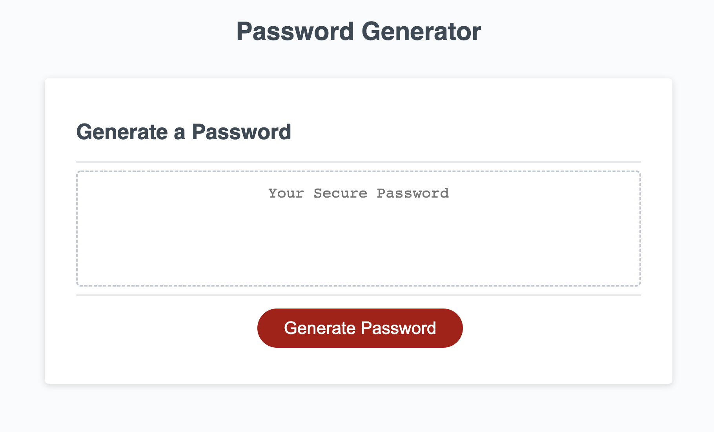

# Password Generator

## **Description**
The purpose of this project was to create a password generator that gives the user the option to choose the length of the password as well as the option to include lowercase letters, uppercase letters, numbers, and/or special characters.

**Link to deployed Github page ➝** [https://abbygraves.github.io/3-pass-gen-mission/](https://abbygraves.github.io/3-pass-gen-mission/)

 

## **Built With:**
+ HTML
+ CSS 
+ JavaScript

 

## **What I Did**
+ Created variales for each of the required password criteria
+ Created a pop up window for each criteria that gives the user the ability to choose whether they would or would not like to include the specfic criteria
+ Included if statemets that add the specified criteria to the new password pool if the user chooses to add it
+ Made sure that the user must selct at least one criteria and if they do not then the prompts will run again
+ Made a for loop to randomize the information added to the new password pool and execute the result on the page